# Database Schema — EdLink rostering integration Framework

> Generated from Alembic migrations V0001-V0006. Update this file in the same change set as any migration per `.claude/rules/alembic.md` § "ERD update gate".
> Standalone mermaid file at [`erd.mermaid`](erd.mermaid) for use with Excalidraw, IntelliJ, or other external rendering tools.
>
> **Last updated:** 2026-05-28 (V0011: renames roles in `operator_role`. `founder_admin` becomes `owner`; `connector_admin` becomes `admin`. The migration drops `ck_operator_role_value`, rewrites existing rows, and re-adds the check constraint with the new four-role set `('operator','admin','owner','auditor')`. Names align with the de-facto SaaS taxonomy and Workato's integration-platform role names; the rename does not change the partial order (`owner >= admin >= operator`) or `auditor`'s parallel-read scope. V0010: three new canonical tables (`schools`, `classes`, `academic_sessions`) extend reconciliation breadth across all five OneRoster resource families. Each carries `lea_id` as the tenant column with the matching FK to `leas(id)` per `.claude/rules/multi-tenancy.md` and a composite-unique constraint on `(lea_id, id)` so future child tables can compose composite FKs against `(lea_id, id)` without another migration. Soft-delete via `deleted_at` matches the existing canonical convention. Grants: `edlink_app` SELECT/INSERT/UPDATE, `edlink_ops` SELECT, `edlink_dba` full. V0010 also adds three columns to `connector_authorization`: `integration_status` (NOT NULL DEFAULT 'active', check constraint enforces the EdLink enum `inactive|active|requested|disabled|destroyed`), `sharing_scope` (nullable, EdLink's sharing scope per integration), `integration_status_observed_at` (nullable, the timestamp the sync worker last polled the partner-side status). Column-level UPDATE on these three is granted to `edlink_app` so the sync worker can write them without broadening the row-level grant. V0009: three onboarding columns on `leas`: `status` (NOT NULL DEFAULT 'onboarding', indexed) covers the onboarding lifecycle (onboarding | active | decommissioned); `timezone` (NOT NULL DEFAULT 'America/New_York') carries the IANA timezone identifier for downstream compliance math; `edlink_integration_id` (nullable, unique) carries the EdLink integration id so the connector framework can look up the right context without a side-channel lookup. Index on `status`, unique constraint on `edlink_integration_id`. V0008: `idempotency_keys` replay table. V0007: composite FK on `enrollments(lea_id, student_id)` -> `students(lea_id, id)`. V0006: `reconciliation_runs` audit table for the daily Merkle reconciliation pass. One row per pass per LEA carrying the canonical-side root hash, the partner-side root hash, the status (`matched`, `drift_detected`, `skipped_quiet_window`, `failed`), and a JSONB drift_summary listing per-entity-type mid-hash mismatches plus affected entity ids. Append-only via the three-role grant pattern: `edlink_app` reads + inserts (the reconciliation worker runs as the app role), `edlink_ops` reads, `edlink_dba` has full retention access. Indexes on `(lea_id, started_at)` and `(status, started_at)` for the dashboard's per-LEA timeline and the drift-status filter. V0005: `operator_lea_grant` table closes the per-operator LEA scope gap left in V0004. The `operator` role gets explicit grants from this table; `owner`, `admin`, and `auditor` keep their implicit organization-wide access. Append-only history via `revoked_at`/`revoked_by`; partial unique index on `(operator_id, lea_id) WHERE revoked_at IS NULL` enforces "at most one active grant per (operator, LEA)" at the DB level. Grants follow the three-role pattern: `edlink_app` SELECT, `edlink_ops` SELECT + INSERT + column-level UPDATE on the supersession columns, `edlink_dba` full. V0004: four tables for operator identity, role grants, connector authorization, and unified non-sync audit. `operator` holds one row per human authenticated against the IdP, keyed by the JWT `sub` claim. `operator_role` is append-only history with a partial unique index on `(operator_id) WHERE revoked_at IS NULL` so at most one active role per operator is enforced at the DB level. `connector_authorization` is per `(lea_id, partner)` with a partial unique index on the non-revoked rows and a `secret_ref` column that names a Key Vault secret (the token itself never lives in Postgres). `audit_log` is the unified audit table for non-sync actions; sync-side audit stays in `sync_jobs`/`revert_actions`/`retry_actions`/`quarantine` and the explorer UNIONs them at read time. Grants follow the three-role pattern: `edlink_app` reads the three auth tables, `edlink_ops` reads+inserts all four with column-level UPDATE on supersession columns, `edlink_dba` has full access. V0003: added `retry_actions` audit table parallel to `revert_actions`, and a `BEFORE UPDATE` trigger on all three snapshot tables that enforces row immutability except for the supersession columns. The trigger compares `to_jsonb(NEW) - 'superseded_by_generation_id' - 'superseded_at'` against the same of `OLD`; any other field change raises. This promotes the temporal-model append-only contract from application discipline to a database-level invariant. V0002: added `source_event_id` and `source_event_at` columns plus `ix_*_source_event_id` indexes on all three snapshot tables. V0001: initial schema, 11 tables, 3 Postgres roles, role-scoped grants.)

---

## Entity Relationship Diagram

```mermaid
erDiagram
    leas ||--o{ students : "has many"
    leas ||--o{ enrollments : "has many"
    students ||--o{ enrollments : "enrolled in"

    sync_jobs ||--o{ lea_snapshots : "generation_id"
    sync_jobs ||--o{ lea_snapshots : "superseded_by"
    sync_jobs ||--o{ student_snapshots : "generation_id"
    sync_jobs ||--o{ student_snapshots : "superseded_by"
    sync_jobs ||--o{ enrollment_snapshots : "generation_id"
    sync_jobs ||--o{ enrollment_snapshots : "superseded_by"

    sync_jobs ||--o{ sync_validation_results : "audited by"
    sync_jobs ||--o{ revert_actions : "reverted by"
    sync_jobs ||--o{ retry_actions : "retried by"
    sync_jobs ||--o{ quarantine : "quarantined by"

    leas {
        varchar id PK
        varchar name
        varchar lea_type "LeaType: traditional_district|charter_lea|charter_cmo|boces|state_agency"
        varchar(2) state "USPS"
        varchar nces_lea_id "nullable"
        varchar status "onboarding|active|decommissioned (V0009); indexed; default 'onboarding'"
        varchar timezone "IANA timezone (V0009); default 'America/New_York'"
        varchar edlink_integration_id "EdLink integration id (V0009); nullable; unique"
        timestamptz deleted_at "soft-delete; nullable"
    }

    students {
        varchar id PK
        varchar lea_id FK "to leas.id; indexed"
        varchar given_name
        varchar family_name
        varchar grade "OneRoster grade string; nullable"
        varchar preferred_first_name "nullable"
        varchar primary_school_id "nullable"
        jsonb external_ids "default {}; SIS + partner IDs"
        timestamptz deleted_at "soft-delete; nullable"
    }

    enrollments {
        varchar id PK
        varchar lea_id FK "to leas.id; indexed"
        varchar student_id FK "to students.id; indexed"
        varchar class_id "canonical ClassId NewType pending"
        date begin_date
        date end_date "nullable; NULL = active"
        timestamptz deleted_at "soft-delete; nullable"
    }

    lea_snapshots {
        uuid snapshot_id PK
        varchar lea_id "natural key; indexed"
        uuid generation_id FK "to sync_jobs.id; indexed"
        uuid superseded_by_generation_id FK "to sync_jobs.id; nullable; indexed"
        timestamptz superseded_at "nullable"
        boolean deleted_upstream "default false"
        varchar source_event_id "high-water mark for replay dedup; nullable; indexed (V0002)"
        timestamptz source_event_at "partner created_date; nullable (V0002)"
        timestamptz created_at
        jsonb payload "full canonical entity payload"
    }

    student_snapshots {
        uuid snapshot_id PK
        varchar student_id "natural key; indexed"
        varchar lea_id "tenant scope; indexed"
        uuid generation_id FK "to sync_jobs.id; indexed"
        uuid superseded_by_generation_id FK "to sync_jobs.id; nullable; indexed"
        timestamptz superseded_at "nullable"
        boolean deleted_upstream "default false"
        varchar source_event_id "high-water mark for replay dedup; nullable; indexed (V0002)"
        timestamptz source_event_at "partner created_date; nullable (V0002)"
        timestamptz created_at
        jsonb payload "full canonical entity payload"
    }

    enrollment_snapshots {
        uuid snapshot_id PK
        varchar enrollment_id "natural key; indexed"
        varchar lea_id "tenant scope; indexed"
        uuid generation_id FK "to sync_jobs.id; indexed"
        uuid superseded_by_generation_id FK "to sync_jobs.id; nullable; indexed"
        timestamptz superseded_at "nullable"
        boolean deleted_upstream "default false"
        varchar source_event_id "high-water mark for replay dedup; nullable; indexed (V0002)"
        timestamptz source_event_at "partner created_date; nullable (V0002)"
        timestamptz created_at
        jsonb payload "full canonical entity payload"
    }

    sync_jobs {
        uuid id PK
        varchar lea_id "tenant scope; indexed"
        varchar partner "edlink|ednition|..."
        varchar status "running|success|failed|revert; indexed"
        timestamptz started_at
        timestamptz completed_at "nullable"
        integer event_count "default 0"
        integer error_count "default 0"
        integer warning_count "default 0"
        varchar cursor_before "nullable"
        varchar cursor_after "nullable"
        varchar partner_checksum "nullable; Merkle session 3"
        varchar canonical_checksum "nullable; Merkle session 3"
        boolean checksum_match "nullable; Merkle session 3"
        text error_summary "nullable; short blocking-issue list"
    }

    sync_validation_results {
        uuid id PK
        uuid sync_job_id FK "to sync_jobs.id; indexed"
        integer layer "1..5"
        varchar code "stable identifier"
        varchar payload_reference "nullable; event_id when per-event"
        jsonb detail "issue context including severity"
        timestamptz created_at
    }

    revert_actions {
        uuid id PK
        uuid sync_job_id FK "to sync_jobs.id; indexed; the sync_job that was reverted"
        uuid revert_generation_id "synthetic sync_jobs row of status=revert"
        varchar operator_identity "JWT sub or CLI operator"
        text reason "free-text justification"
        timestamptz reverted_at
        integer snapshots_restored "default 0; 0 means idempotent no-op"
    }

    retry_actions {
        uuid id PK
        uuid sync_job_id FK "to sync_jobs.id; indexed; the sync_job that was retried"
        varchar lea_id "tenant scope; indexed"
        varchar partner "edlink|ednition|..."
        varchar operator_identity "JWT sub or CLI operator"
        text reason "free-text justification"
        timestamptz retried_at
        varchar cursor_rewound_to "nullable; cursor value the LEA was rewound to"
        boolean forced "default false; true when --force used on non-failed sync"
    }

    quarantine {
        uuid id PK
        uuid sync_job_id FK "to sync_jobs.id; indexed"
        varchar lea_id "tenant scope; indexed"
        varchar entity_type "lea|student|enrollment"
        varchar entity_id "natural key of the orphaned entity"
        text reason "Layer 4 referential violation note"
        jsonb raw_payload "original event payload for re-release"
        timestamptz created_at
        timestamptz resolved_at "nullable"
        varchar resolution_status "nullable; released|rejected"
        varchar resolution_operator "nullable; JWT sub"
    }

    cursor_state {
        varchar lea_id PK "composite PK part 1"
        varchar partner PK "composite PK part 2"
        varchar last_event_id "nullable"
        timestamptz last_event_at "nullable; cursor-lag query feeds 20-day alert"
        timestamptz last_poll_at "nullable"
        boolean cold_start_required "default false; triggered when cursor passes 30-day retention"
        timestamptz updated_at
    }

    operator ||--o{ operator_role : "granted to"
    operator ||--o{ operator_role : "granted by"
    operator ||--o{ connector_authorization : "authorized by"
    operator ||--o{ audit_log : "performed by"
    leas ||--o{ connector_authorization : "per LEA"
    leas ||--o{ audit_log : "scoped to (nullable)"

    operator {
        uuid id PK
        text subject "IdP sub claim; unique"
        text display_name
        text email "unique via functional index on lower(email)"
        text status "active|disabled|locked"
        timestamptz created_at "default now()"
        timestamptz last_seen_at "nullable; updated on each authenticated request"
    }

    operator_role {
        uuid id PK
        uuid operator_id FK "to operator.id"
        text role "operator|admin|owner|auditor"
        timestamptz granted_at "default now()"
        uuid granted_by FK "to operator.id; bootstrap row references itself"
        timestamptz revoked_at "nullable; partial unique on (operator_id) WHERE revoked_at IS NULL"
        uuid revoked_by FK "to operator.id; nullable"
        text reason
    }

    connector_authorization {
        uuid id PK
        varchar lea_id FK "to leas.id"
        text partner "edlink|ednition|..."
        text status "pending|active|revoked|locked; default pending"
        timestamptz authorized_at "nullable"
        uuid authorized_by FK "to operator.id; nullable"
        timestamptz revoked_at "nullable"
        uuid revoked_by FK "to operator.id; nullable"
        text secret_ref "Key Vault secret name; value never in PG"
        integer poll_interval_seconds "default 300"
        text notes "nullable"
    }

    audit_log {
        uuid id PK
        uuid operator_id FK "to operator.id"
        text action "stable code, e.g. operator.role_granted"
        text target_kind "operator|lea|connector_authorization"
        text target_id "uuid or LEA id"
        varchar lea_id FK "to leas.id; nullable for LEA-scoped reads"
        text reason
        jsonb detail "nullable; structured action context"
        timestamptz created_at "default now()"
    }

    operator ||--o{ operator_lea_grant : "granted to"
    operator ||--o{ operator_lea_grant : "granted by"
    leas ||--o{ operator_lea_grant : "scopes operator"

    operator_lea_grant {
        uuid id PK
        uuid operator_id FK "to operator.id; indexed"
        varchar lea_id FK "to leas.id; indexed"
        timestamptz granted_at "default now()"
        uuid granted_by FK "to operator.id"
        timestamptz revoked_at "nullable; partial unique on (operator_id, lea_id) WHERE revoked_at IS NULL"
        uuid revoked_by FK "to operator.id; nullable"
        text reason
    }
```

---

## Table Summary

| Table | Migration | Family | Purpose |
|---|---|---|---|
| `leas` | V0001 | Canonical | Multi-tenant root. `lea_id` references this table everywhere. Includes charter LEAs and CMOs. |
| `students` | V0001 | Canonical | Current view of students per LEA. Soft-deleted via `deleted_at`. |
| `enrollments` | V0001 | Canonical | Current view of student-class enrollments. References `students` and `leas`. |
| `lea_snapshots` | V0001, V0002 | History | Append-only history of LEA-level changes. V0002 added `source_event_id` and `source_event_at`. |
| `student_snapshots` | V0001, V0002 | History | Append-only history per student. Sync worker writes one snapshot per event for the student's natural key. |
| `enrollment_snapshots` | V0001, V0002 | History | Append-only history per enrollment. |
| `sync_jobs` | V0001 | Audit | One row per sync transaction. `status='revert'` rows are synthetic markers the revert service inserts so the snapshot FK to `sync_jobs.id` stays enforced through a revert. |
| `sync_validation_results` | V0001 | Audit | One row per Layer 1-5 issue (error, warning, or quarantine-routing). |
| `revert_actions` | V0001 | Audit | Operator-driven revert log. `snapshots_restored = 0` means the revert was a no-op (already-reverted sync_job). |
| `retry_actions` | V0003 | Audit | Operator-driven retry log. One row per CLI invocation. Records the cursor value the retry rewound to so the audit trail explains why the next drain replayed a backlog. |
| `quarantine` | V0001 | Audit | Layer 4 orphan rows the batch chose not to commit to canonical. Operator releases or rejects via session 3 CLI commands. |
| `cursor_state` | V0001 | Operational | One row per `(lea_id, partner)`. Tracks where incremental polling is. Feeds the 20-day cursor-lag alert. |
| `operator` | V0004 | Auth | One row per authenticated human. `subject` is the IdP `sub` claim, stable across email changes. Email uniqueness is case-insensitive via a functional unique index on `lower(email)`. |
| `operator_role` | V0004 | Auth | Append-only role-grant history. Partial unique index on `(operator_id) WHERE revoked_at IS NULL` enforces "at most one active role per operator" at the DB level. Role changes write a new row and revoke the prior. |
| `connector_authorization` | V0004 | Auth | Per `(lea_id, partner)` authorization state. Partial unique index on `(lea_id, partner) WHERE revoked_at IS NULL` keeps the dashboard read honest. `secret_ref` names a Key Vault secret; the value is never in Postgres. |
| `audit_log` | V0004 | Audit | Unified audit table for non-sync operator actions (role grants, connector authorizations, founder admin actions). Sync-side audit stays in the per-sync tables; the explorer UNIONs them at read time. |
| `operator_lea_grant` | V0005 | Auth | Per-operator LEA scope for the `operator` role. The auth module loads active grants here when computing `authorized_leas`. Founder_admin/admin/auditor get implicit organization-wide access and do not need rows in this table. Append-only history; the partial unique index keeps the active set unambiguous. |

---

## Key Constraints

- **Multi-tenancy:** Every tenant-scoped table carries `lea_id`. Per `.claude/rules/multi-tenancy.md`, the application enforces `lea_id` filtering at every read site; the schema indexes `lea_id` for query performance.
- **Snapshots are append-only (DB-enforced, V0003):** `edlink_app` has `INSERT` and limited `UPDATE` privileges only on the supersession columns. V0003 adds a `BEFORE UPDATE` trigger on every snapshot table that uses `to_jsonb(NEW) - 'superseded_by_generation_id' - 'superseded_at'` to detect any field change other than the two supersession columns and raises if found. The temporal-model contract is now a database invariant, not just application discipline.
- **Supersession invariant:** At most one snapshot per `(lea_id, natural_key)` has `superseded_by_generation_id IS NULL`. The sync worker maintains this by `UPDATE`-ing the prior live snapshot before `INSERT`-ing a new one.
- **Replay dedup invariant (V0002):** Before writing a new snapshot, the sync worker compares the incoming event's `source_event_id` against the live snapshot's `source_event_id` for the same natural key. If incoming is less than or equal to existing, the event is skipped. This is what makes "process the same page twice" produce zero new snapshot rows. EdLink event IDs are monotonic, so the lexicographic comparison works; `source_event_at` is stored alongside for defensive timeline queries.
- **Revert FK preservation:** The snapshot `superseded_by_generation_id` FK targets `sync_jobs.id`. To mark a snapshot as reverted, the revert service inserts a synthetic `sync_jobs` row with `status='revert'` whose ID becomes the new generation marker. The "refuse if superseded by a newer sync" guardrail filters `status='revert'` out so repeated reverts do not falsely refuse.
- **Three Postgres roles, role-scoped grants:** `edlink_app` (sync worker, INSERT + limited UPDATE), `edlink_ops` (operator CLI, SELECT + supersede-only UPDATE + revert/quarantine INSERT), `edlink_dba` (retention + break-glass, full UPDATE/DELETE). No DELETE for `edlink_app` anywhere. V0004 extends this: `edlink_app` reads `operator`/`operator_role`/`connector_authorization` for the JWT validator's authz lookups but never writes; `edlink_ops` reads+inserts all four auth tables and has column-level UPDATE on supersession columns only (`operator.last_seen_at`/`operator.status`, `operator_role.revoked_at`/`operator_role.revoked_by`, `connector_authorization.status`/`authorized_at`/`authorized_by`/`revoked_at`/`revoked_by`/`secret_ref`/`poll_interval_seconds`/`notes`).
- **Cursor composite key:** `cursor_state` has `(lea_id, partner)` as a composite primary key so a single LEA can be sourced from multiple partners (EdLink rostering + Ednition IEP in the same deployment).
- **Soft delete everywhere:** `leas`, `students`, `enrollments` use `deleted_at` rather than row deletion. Revert reactivates entities by clearing `deleted_at` to NULL, never by re-inserting.

---

## Indexes

| Index | Table | Columns | Purpose |
|---|---|---|---|
| `ix_students_lea_id` | `students` | `(lea_id)` | LEA-scoped student lookups |
| `ix_enrollments_lea_id` | `enrollments` | `(lea_id)` | LEA-scoped enrollment lookups |
| `ix_enrollments_student_id` | `enrollments` | `(student_id)` | Student → enrollments join |
| `ix_sync_jobs_lea_id` | `sync_jobs` | `(lea_id)` | List-syncs by LEA |
| `ix_sync_jobs_status` | `sync_jobs` | `(status)` | Failed-sync alerts |
| `ix_sync_validation_results_sync_job_id` | `sync_validation_results` | `(sync_job_id)` | Show-sync detail |
| `ix_revert_actions_sync_job_id` | `revert_actions` | `(sync_job_id)` | Revert history per sync |
| `ix_retry_actions_sync_job_id` | `retry_actions` | `(sync_job_id)` | Retry history per sync (V0003) |
| `ix_retry_actions_lea_id` | `retry_actions` | `(lea_id)` | LEA-scoped retry timeline (V0003) |
| `ix_quarantine_lea_id` | `quarantine` | `(lea_id)` | List-quarantine by LEA |
| `ix_quarantine_sync_job_id` | `quarantine` | `(sync_job_id)` | Show-sync detail |
| `ix_lea_snapshots_lea_id` | `lea_snapshots` | `(lea_id)` | LEA snapshot lookups |
| `ix_lea_snapshots_generation_id` | `lea_snapshots` | `(generation_id)` | Revert: find snapshots from a sync_job |
| `ix_lea_snapshots_superseded_by` | `lea_snapshots` | `(superseded_by_generation_id)` | Revert: find prior superseded snapshot |
| `ix_lea_snapshots_source_event_id` | `lea_snapshots` | `(source_event_id)` | Replay dedup high-water mark (V0002) |
| `ix_student_snapshots_*` | `student_snapshots` | (same as lea_snapshots) | Same purposes per student |
| `ix_enrollment_snapshots_*` | `enrollment_snapshots` | (same as lea_snapshots) | Same purposes per enrollment |
| `uq_operator_subject` | `operator` | `(subject)` | IdP `sub` claim uniqueness (V0004) |
| `uq_operator_email_ci` | `operator` | `lower(email)` | Case-insensitive email uniqueness (V0004) |
| `ix_operator_role_operator_id` | `operator_role` | `(operator_id)` | Active-role lookup at request time (V0004) |
| `uq_operator_role_active` | `operator_role` | `(operator_id) WHERE revoked_at IS NULL` | At most one active role per operator (V0004) |
| `ix_connector_authorization_lea_partner` | `connector_authorization` | `(lea_id, partner)` | Per-LEA partner column on the dashboard (V0004) |
| `uq_connector_authorization_live` | `connector_authorization` | `(lea_id, partner) WHERE revoked_at IS NULL` | At most one live authorization per LEA+partner (V0004) |
| `ix_audit_log_operator_created` | `audit_log` | `(operator_id, created_at)` | Audit explorer "by operator" query (V0004) |
| `ix_audit_log_lea_created` | `audit_log` | `(lea_id, created_at)` | Audit explorer "by LEA" query (V0004) |
| `ix_audit_log_action_created` | `audit_log` | `(action, created_at)` | Audit explorer "by action code" query (V0004) |
| `ix_operator_lea_grant_operator_id` | `operator_lea_grant` | `(operator_id)` | Auth-time lookup of an operator's scoped LEAs (V0005) |
| `ix_operator_lea_grant_lea_id` | `operator_lea_grant` | `(lea_id)` | "Who can access LEA X" admin query (V0005) |
| `uq_operator_lea_grant_active` | `operator_lea_grant` | `(operator_id, lea_id) WHERE revoked_at IS NULL` | At most one active grant per (operator, LEA) (V0005) |

## Cross-references

- [`docs/design/edlink-oneroster-rostering.md`](../design/edlink-oneroster-rostering.md) — full design rationale for the rostering POC
- [`docs/design/diagrams/edlink-architecture.excalidraw`](../design/diagrams/edlink-architecture.excalidraw) — system-level architecture diagram (not data-model)
- [`architecture/data-model.md`](../../architecture/data-model.md) — canonical entity definitions at the framework layer
- [`.claude/rules/alembic.md`](../../.claude/rules/alembic.md) — migration discipline and ERD update gate
- [`.claude/rules/multi-tenancy.md`](../../.claude/rules/multi-tenancy.md) — `lea_id` threading
- [`.claude/rules/temporal-model.md`](../../.claude/rules/temporal-model.md) — append-only snapshot model
